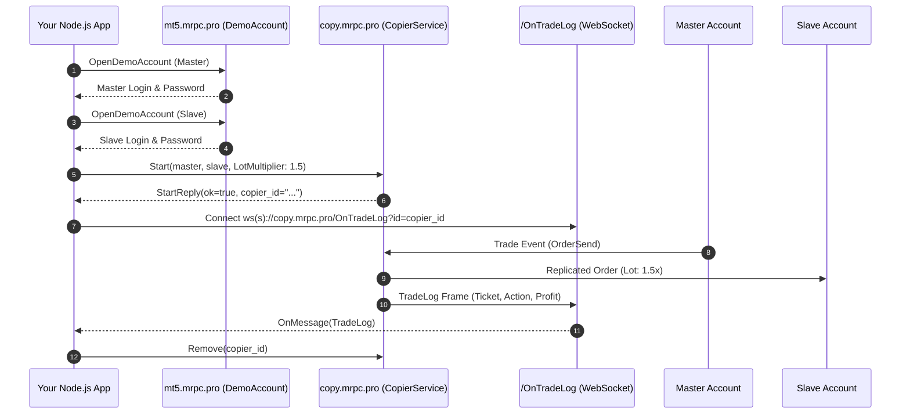

# Quick Start: Your First Project in 10 Minutes

This step-by-step tutorial walks you through building a complete trade replication application in **Node.js** from scratch using **NodeCopier**.

---

## 1. Overview of Steps

In this guide you will:
1. **Provision two demo MetaTrader accounts** via gRPC (`DemoAccount.OpenDemoAccount`).
2. **Connect to MetaRPC Trade Copier** over HTTP/2 gRPC (`copy.mrpc.pro:443`).
3. **Start an active copier** configured with risk multipliers and SL/TP synchronization.
4. **List all registered copiers** and inspect their state.
5. **Stream real-time trade logs** via WebSocket (`/OnTradeLog?id={copierId}`).
6. **Pause and remove** the copier cleanly.

---

## 2. Complete Runnable Code

```typescript
import { CopierService, DemoAccountClient } from '@metarpc/nodecopier';

async function main() {
    // 1. Provision Demo Accounts via gRPC
    const demo = new DemoAccountClient('https://mt5.mrpc.pro:443');
    const master = await demo.openDemoAccount({ company: 'MetaQuotes-Demo', firstName: 'Master', lastName: 'Trader', email: 'master@example.com', server: 'MetaQuotes-Demo' });
    const slave = await demo.openDemoAccount({ company: 'MetaQuotes-Demo', firstName: 'Slave', lastName: 'Follower', email: 'slave@example.com', server: 'MetaQuotes-Demo' });
    console.log(`Created accounts: Master=${master.login}, Slave=${slave.login}`);

    // 2. Initialize Copier Service
    const copier = new CopierService('https://copy.mrpc.pro:443', { userKey: 'YOUR_USER_KEY' });

    // 3. Start Copier
    const startRes = await copier.start({
        userKey: 'YOUR_USER_KEY',
            master: { type: 'MT5', user: master.login, password: master.password, server: master.server },
        slave: { type: 'MT5', user: slave.login, password: slave.password, server: slave.server },
        riskType: 'LotMultiplier',
        riskValue: '1.5',
        copySl: true,
        copyTp: true,
        copyPendingOrders: true,
        reverseCopy: false
    });
    console.log(`Copier Started! ID: ${startRes.copierId}`);

    // 4. Query active copiers
    const list = await copier.list();
    for (const c of list.copiers) {
        console.log(`Copier: ${c.id} [${c.masterUser} -> ${c.slaveUser}], Paused: ${c.paused}`);
    }

    // 5. Stream Trade Logs via WebSocket
    const ws = copier.streamTradeLogs(startRes.copierId, (log) => {
        console.log(`[TRADE LOG] Ticket: ${log.slaveOrder?.ticket}, Action: ${log.updateType}, Profit: ${log.profit}`);
    });

    // 6. Cleanup
    await new Promise((resolve) => setTimeout(resolve, 3000));
    ws.close();
    await copier.pause(startRes.copierId, true);
    await copier.remove(startRes.copierId);
    console.log('Copier stopped and removed cleanly.');
}

main().catch(console.error);
```

---

## 3. How It Works Under the Hood


